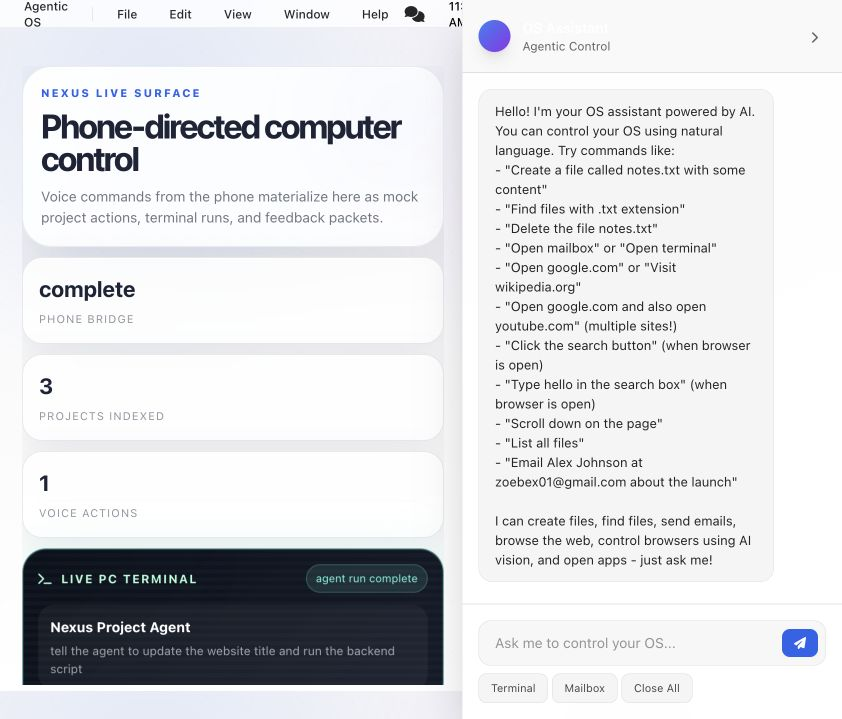
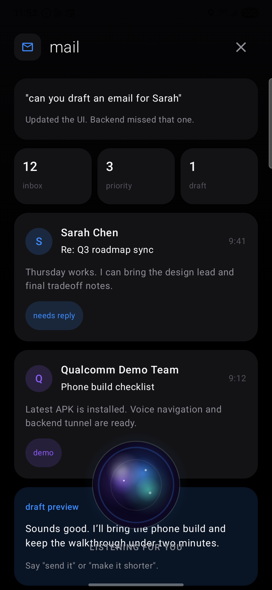

# Nexus

Nexus is a phone-to-desktop AI OS prototype for controlling a computer through natural voice. The Android app acts like an AI-native remote, while the desktop web dashboard visualizes routed commands, project actions, mock email/message flows, and live agent execution state.

## Hackathon Submission

Nexus demonstrates a multimodal AI OS loop: speak naturally to the phone, and the desktop becomes the execution surface for an agent. The prototype shows how voice can route email, messages, project feedback, and PC script commands into a realistic live dashboard with fast, visual feedback.

## Screenshots

| Desktop command center | Mobile voice UI |
| --- | --- |
|  |  |

## What It Does

- **Voice-controlled mobile UI** — navigate sections like Mail, Messages, Code, Tasks, Search, Calendar, and Maps from spoken commands.
- **Desktop command center** — shows agent runs, project activity, terminal-style output, and command status on the web dashboard.
- **Phone-to-PC relay mock** — commands like “run this script on the project” or “give feedback” appear as live project events on desktop.
- **Demo-ready app surfaces** — each mobile section includes realistic mock UI so the assistant can show visible actions instead of generic replies.
- **LLM-ready backend** — FastAPI routes handle chat, voice, browser, files, email, slideshow, Hyperspell context, and demo project commands.

## Demo Flow

1. Start the backend on the computer.
2. Open the dashboard at `http://127.0.0.1:8000`.
3. Launch the Android app on a connected phone.
4. Speak commands such as:
   - “Open mail and send an email to Sarah.”
   - “Open code and run the deploy preview script.”
   - “Send feedback to the mobile demo project.”
   - “Show messages and summarize the demo team thread.”
5. Watch the phone update its mock UI while the desktop dashboard shows the agent run and terminal activity.

## Project Structure

```text
.
├── agentic_os/                 # FastAPI backend modules
│   ├── app.py                  # App factory and lifecycle wiring
│   ├── chat.py                 # Chat route, action routing, demo command bridge
│   ├── demo.py                 # Phone-to-PC project relay state
│   ├── email.py                # Email compose/inbox routes
│   ├── voice.py                # Voice processing, TTS, STT routes
│   ├── browser.py              # Browser automation routes
│   └── state.py                # Runtime state caches
├── android-app/                # Native Android / Jetpack Compose client
├── static/                     # Desktop dashboard JavaScript and CSS
├── templates/                  # Web dashboard HTML
├── docs/images/                # README screenshots
└── main.py                     # Backend entry point
```

## Run the Desktop Backend

```bash
python -m venv .venv
source .venv/bin/activate
pip install -r requirements.txt
uvicorn main:app --host 0.0.0.0 --port 8000 --reload
```

Then open:

```text
http://127.0.0.1:8000
```

## Run on Android

For a physical USB-connected phone, reverse the backend port so the app can reach the computer through `localhost`:

```bash
adb reverse tcp:8000 tcp:8000
cd android-app
./gradlew installDebug
adb shell am start -n com.agenticos.app/.MainActivity
```

The Android build is configured to use `http://127.0.0.1:8000` for USB demo mode. For a LAN or deployed demo, update `BACKEND_BASE_URL` in `android-app/app/build.gradle.kts`.

## Environment

Create a `.env` file in the repo root when using live AI or optional integrations:

```env
OPENAI_API_KEY=your_openai_api_key_here

# Optional Hyperspell context
HYPERSPELL_API_KEY=your_hyperspell_api_key_here
HYPERSPELL_BASE_URL=https://api.hyperspell.com
HYPERSPELL_QUERY_PATH=/memories/query
HYPERSPELL_TIMEOUT_SECONDS=10

# Optional email endpoint overrides
RAILWAY_EMAIL_API=https://web-production-02ec.up.railway.app/compose-send
RAILWAY_EMAIL_INBOX_API=https://web-production-02ec.up.railway.app/emails
```

Without optional keys, Nexus still runs as a polished mock/demo experience.

## Useful API Routes

- `POST /api/chat` — main assistant route used by the phone.
- `POST /api/demo/commands` — records project/script/feedback events for the dashboard.
- `GET /api/demo/projects` — returns the current desktop demo state.
- `POST /api/voice/process` — voice-oriented command processing.
- `POST /api/email/compose-send` — email compose/send integration or mock path.
- `GET /health` — backend health check.

## Notes

- The current prototype is optimized for a hackathon demo: fast, visual, and believable even when integrations are mocked.
- Real integrations can be swapped into the existing routes without changing the phone/dashboard interaction model.
- The dashboard should be left open while demoing from the phone so relay events are visible in real time.

## License

MIT
